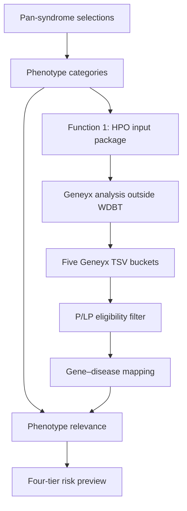

# WDBT Hybrid Workflow

**Handoff baseline:** v0.5  
**Status:** Functional Streamlit reference implementation, ready for technical handoff  
**Last validated:** 2026-09-11

WDBT translates clinician-selected pan-syndrome observations into an HPO input package for Geneyx (Function 1), then combines Geneyx-interpreted P/LP candidate TSVs with the active gene–disease–phenotype map to generate a traceable four-tier risk-strata preview (Function 2).

> **Scope boundary**  
> This repository is a functional workflow reference and validation environment. It is not a production system, clinical decision support tool, or formal reporting application. It is not connected to Geneyx or TGIA base.

## 中文摘要

本專案為可交接的 WDBT Streamlit reference implementation：

- Function 1：將兒基安泛性症狀轉譯為 phenotype categories 與 HPO／Geneyx-ready input。
- Function 2：讀取五類 Geneyx TSV，篩選已判讀的 P/LP variants，串接 active gene–disease–phenotype mapping，並依固定 decision tree 產生四層風險分層預覽。
- primary 與 secondary phenotype categories 的命中權重相同；來源保留於 trace，但不影響 risk tier。
- 未被 active disease map 覆蓋的 P/LP candidate 會保留提示，不會被強制分層。

此版本已完成固定案例回歸測試，可供 IT／生資檢視、重現與後續系統化；正式串接、權限、資料庫、稽核軌跡、臨床驗證與正式報告仍屬 productionization 範圍。

## Workflow



## Function 1｜HPO Translation

Function 1 performs input preparation only.

### Inputs

- One or more `pan_syndrome_id` selections
- Sample ID
- Physician supplemental note field
- Top N display limit for the HPO preview

### Processing

1. Reads primary and secondary phenotype categories from `pan_syndrome_master.csv`.
2. Treats primary and secondary categories equally during expansion.
3. Maps each phenotype category to HPO IDs and terms through `phenotype_category_to_hpo.csv`.
4. Deduplicates the Geneyx-ready output by HPO ID and term while retaining source pan-syndrome IDs and phenotype categories.

### Outputs

- Selected pan-syndrome context
- Phenotype-category expansion
- HPO mapping preview
- Downloadable UTF-8 Geneyx-ready HPO CSV

Function 1 does not perform disease inference, variant interpretation, or risk stratification.

## Function 2｜Post-Geneyx Risk Strata

Function 2 requires all five Geneyx TSV exports:

- `Dominant HET.tsv`
- `Mitochondria.tsv`
- `Recessive Compound HET.tsv`
- `Recessive HET.tsv`
- `Recessive HOM.tsv`

### Candidate eligibility

A Geneyx row enters risk stratification only when:

- `Relevance` is not blank; and
- normalized `Pathogenic` equals `Pathogenic` or `Likely Pathogenic`.

VUS and benign rows are excluded. The inheritance-mode input comes from the uploaded TSV bucket, not from the reference-only inheritance field in the disease map.

### Phenotype relevance

- Selected primary and secondary phenotype categories are merged with equal weight.
- Disease relevance is `Yes` when at least one selected category overlaps the disease `phenotype_concern_list`; otherwise it is `No`.
- Match sources such as `PS003.secondary: hearing concern` are retained for traceability.
- Multiple provenance rows for the same gene and disease ID are collapsed into one disease-level result; reference IDs remain visible.

### Decision tree

| Geneyx bucket | Phenotype relevance | Level | Output |
|---|---:|---:|---|
| Dominant HET, Recessive Compound HET, Recessive HOM, Mitochondria | Yes | 1 | 🔴 High Attention／高度關注 |
| Dominant HET, Recessive Compound HET, Recessive HOM, Mitochondria | No | 2 | 🟠 Targeted Follow-up／建議追蹤 |
| Recessive HET | Yes | 3 | 🟡 Routine Monitoring／常規監測 |
| Recessive HET | No | 4 | 🔵 General Awareness／一般留意 |

### Outputs

- Geneyx bucket summary
- Interpreted P/LP candidate trace
- Active-map coverage
- Phenotype-relevance mapping
- Downloadable four-tier risk-strata preview

P/LP genes outside the active disease map are retained as an unmapped trace and are not assigned a risk tier.

## Active data contracts

| File | Role | Required structure |
|---|---|---|
| `data/pan_syndrome_master.csv` | Pan-syndrome definitions and phenotype-category assignments | `pan_syndrome_id`, display/section fields, primary and secondary categories |
| `data/phenotype_category_to_hpo.csv` | Function 1 category-to-HPO mapping | One phenotype-category/HPO pair per row |
| `data/gene_disease_phenotype_map.csv` | Function 2 active disease mapping | `disease_id`, `gene`, `disease_name`, `omim_id`, `inheritance`, `phenotype_concern_list` |

Current validated snapshot:

- 20 pan-syndrome items
- 21 phenotype categories and 50 category-to-HPO mappings
- 727 gene–disease mapping rows
- 668 base disease identities
- 636 unique gene symbols

`phenotype_concern_list` uses semicolons between categories. The mapping-table `inheritance` field is retained as reference provenance; the decision tree uses the Geneyx TSV bucket.

## Reference and legacy files

These files remain in the repository but do not drive the current dynamic Function 1/2 path:

- `data/pan_syndrome_to_hpo.csv`
- `data/function2_risk_strata_static.csv`
- `data/reporting_package_mock.json`
- `assets/WDBT_UI_all-2.pdf`

## Acceptance test

Validated reference case:

- Selected pan-syndromes: `PS001`, `PS003`, `PS005`
- Eligible mapped result: `GJB2 c.109G>A`, Recessive HET, Likely Pathogenic
- Phenotype match: `hearing concern`, sourced from `PS003.secondary`
- Expected tier: 🟡 `Routine Monitoring`
- GJB2 benign and ACAD9 VUS rows must not enter stratification
- Multiple GJB2 reference records must collapse into one disease-level result
- COL7A1 remains an expected unmapped P/LP trace and receives no risk tier

Re-run this case after changes to `app.py` or any active dataset.

## Repository structure

```text
wdbt-hybrid-mockup/
├── app.py
├── requirements.txt
├── README.md
├── assets/
│   └── WDBT_UI_all-2.pdf
└── data/
    ├── pan_syndrome_master.csv
    ├── phenotype_category_to_hpo.csv
    ├── gene_disease_phenotype_map.csv
    ├── pan_syndrome_to_hpo.csv
    ├── function2_risk_strata_static.csv
    └── reporting_package_mock.json
```

## Run locally

```bash
python -m pip install -r requirements.txt
streamlit run app.py
```

## Handoff boundary

The v0.5 handoff baseline establishes the workflow logic, file interfaces, trace fields, and acceptance case. A production owner should separately define:

- Geneyx/API integration and upload automation
- Authentication, authorization, and data retention
- Database and mapping-master governance
- Audit logging, versioning, and release controls
- Clinical validation and formal report generation
- Monitoring, deployment, and operational ownership

The physician supplemental note is currently collected by the UI but is not incorporated into HPO expansion or risk-tier logic.

